# 权限管理使用手册

## 名词解释

1、用户：所有使用这个系统的人，添加用户时，用户ID自动生成，按用户名称区分用户。

2、角色：一个用户一个角色，包括管理员、优化师、国内优化师、海外优化师、设计师、国内设计师、海外设计师、运营、国内运营、海外运营、测试工程师。

| 角色  | 角色解释                                                        | 权限                                                                                                                  |
| --- | ----------------------------------------------------------- | ------------------------------------------------------------------------------------------------------------------- |
| 管理员 | 可分配用户的系统数据权限、菜单权限                                           | 有系统内所有产品权限、菜单权限                                                                                                     |
| 优化师 | 既投放国外、又投放国内的优化师                                             | 
1、优化师菜单权限=国内优化师权限＋国外优化师菜单权限

1）有首页、账号管理（部分）、创意中心、投放管理（部分）、报表中心、数据洞察的菜单权限

2、不同优化师的产品权限可能不同
         |
| 设计师 | 
1、对应于市场中心设计师和创意者

2、既负责国内素材、又负责国外素材的市场中心设计师和创意者
 | 
1、设计师菜单权限=国内设计师权限＋国外设计师权限

1）有创意中心、投放管理-海外媒体投放-推广管理、报表中心-国内素材数据、数据洞察-自定义报表的菜单权限

2、不同设计师的产品权限可能不同
  |
| 运营  | 不同产品线的运营                                                    | 
1、运营菜单权限=国内运营菜单权限＋国外运营菜单权限

1）基本只有看数据（报表中心-每日渠道数据、国内实时数据、国内素材数据；数据洞察-自定义报表）、查询的权限

2、不同运营的产品权限可能不同
 |

* 注：角色与菜单权限是绑定的。若新上线一个功能，比如快手搜索批量投放，对应角色会自动拥有该功能的权限（文艺复兴侧给对应角色新增该功能的权限）。

3、产品：公司国内、海外的产品在不同应用（指ios、安卓）的产品线

4、状态：用户的权限是否生效，包含启用、关闭

5、菜单：文艺复兴的菜单栏，指首页、账号管理、创意中心、投放管理、报表中心、数据洞察、系统设置

## 系统数据权限

1、进入路径：文艺复兴系统→系统设置→系统数据权限

2、主要功能与操作：

1）查询：通过用户名称或账号名称、用户角色查询用户（管理员、优化师、设计师、运营、测试）的信息，包括用户ID、用户名称、用户角色、账号名称、邮箱地址、状态

| 步骤  | 操作                         | 图解                                                                | 备注                                                    |
| --- | -------------------------- | ----------------------------------------------------------------- | ----------------------------------------------------- |
| 第一步 | 在用户名称或账号名称、用户角色下拉框中选择查询的条件 | 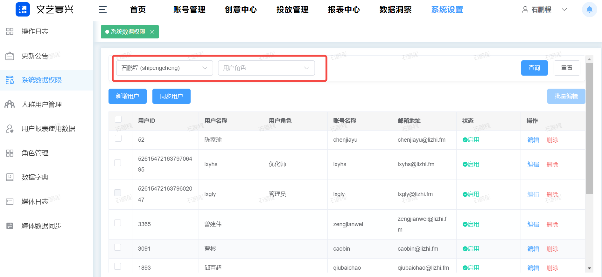 | 两者至少选择其一                                              |
| 第二步 | 点击查询，下方出现用户的信息             | 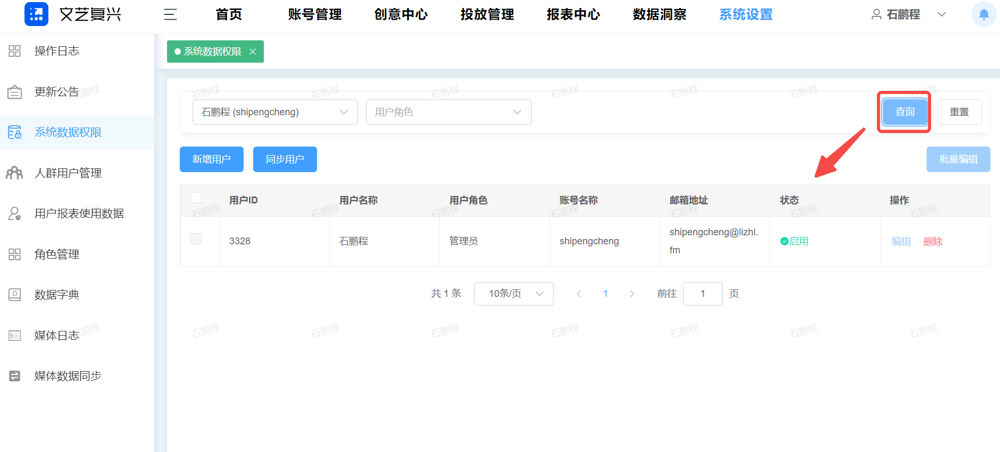 | 若两者都选，但选择的用户名称或账户名称所对应的用户不属于选择的角色（反之亦然），则下方不会出现任何用户信息 |
| 第三步 | 若想重置查询条件，点击重置              | 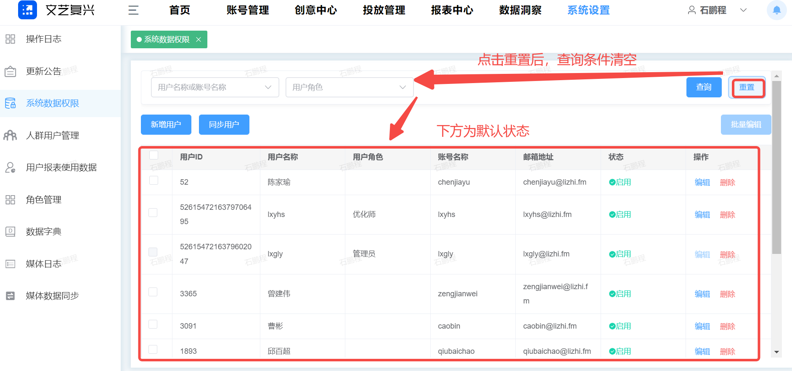 | 无                                                     |

2）编辑：编辑/批量编辑用户的基本信息、产品权限：

* 基本信息：可修改用户邮箱地址、角色、状态

| 步骤  | 操作                                                                                               | 图解                                                                                                                                                                       | 备注               |
| --- | ------------------------------------------------------------------------------------------------ | ------------------------------------------------------------------------------------------------------------------------------------------------------------------------ | ---------------- |
| 第一步 | 单独编辑，则点击编辑即可；批量编辑，则先多选用户，再点击批量编辑                                                                 | 
单独编辑：

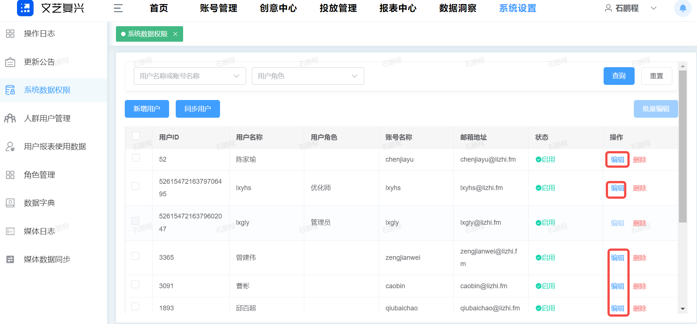

批量编辑：

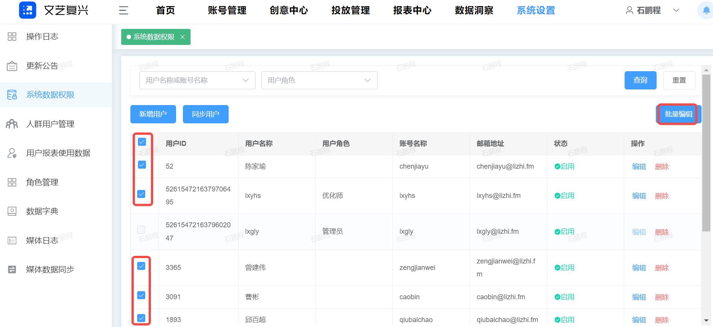
 |                  |
| 第二步 | 
单独编辑时，点击编辑后，默认进入基本信息模块，可通过点击对邮箱、角色、状态进行编辑；

批量编辑时，点击批量编辑后，默认进入基本信息模块，可通过点击对角色、状态进行编辑
 | 
单独编辑：

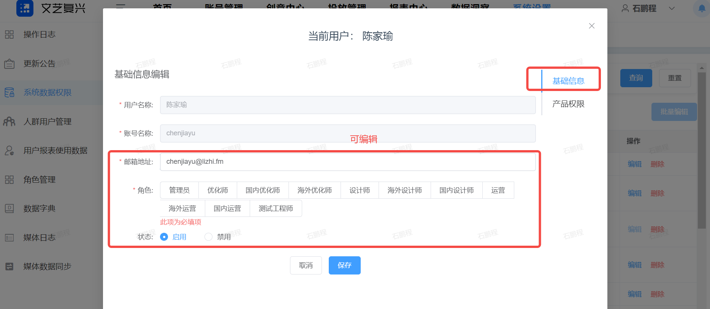

批量编辑：

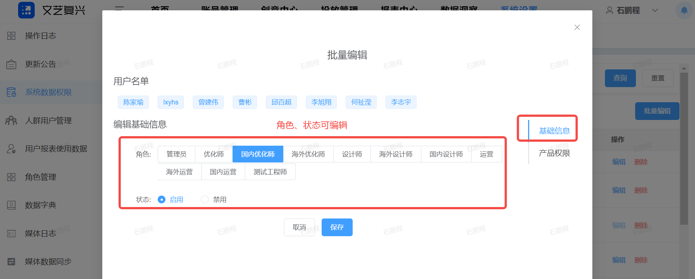
 | 单独编辑时，邮箱、角色为必编辑项 |
| 第三步 | 点击保存，则编辑后的信息同步到页面表格中                                                                             | 
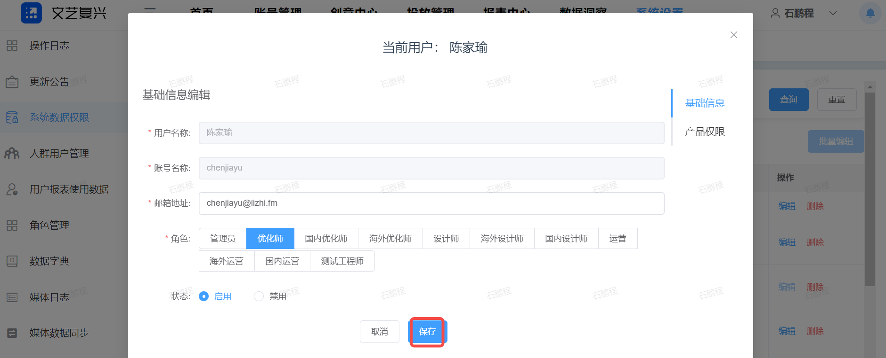

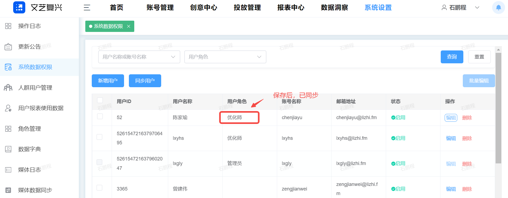
                                                                   | 无                |

* 产品权限：可分配某产品的权限给用户，可修改用户已被分配的产品权限

| 步骤  | 操作                                                                                                                                                              | 图解                                                                                                                                                                                                                                   |
| --- | --------------------------------------------------------------------------------------------------------------------------------------------------------------- | ------------------------------------------------------------------------------------------------------------------------------------------------------------------------------------------------------------------------------------ |
| 第一步 | 
单独编辑，则点击编辑即可；

批量编辑，则先多选用户，再点击批量编辑
                                                                                                                  | 
单独编辑：

批量编辑：

                                                                                                       |
| 第二步 | 
单独编辑时，点击编辑后，出现编辑框，点击进入产品权限模块，进一步点击模块内的编辑按键，可进一步编辑；

批量编辑时，点击批量编辑后，出现编辑框，点击进入产品权限模块，可直接进行编辑；
                                                         | 
单独编辑：

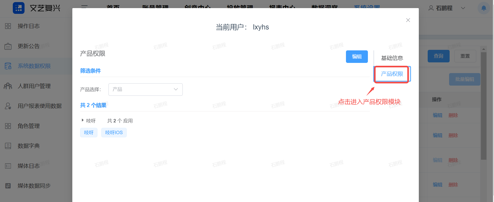

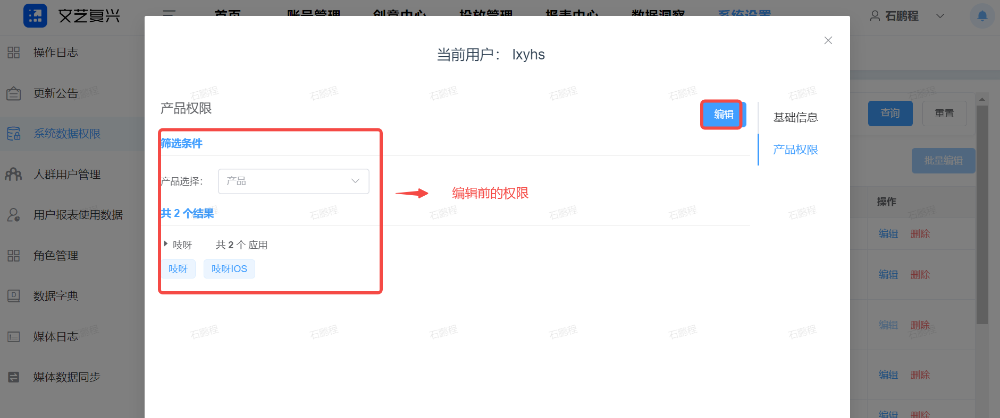

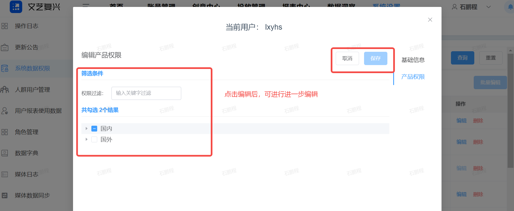

批量编辑：

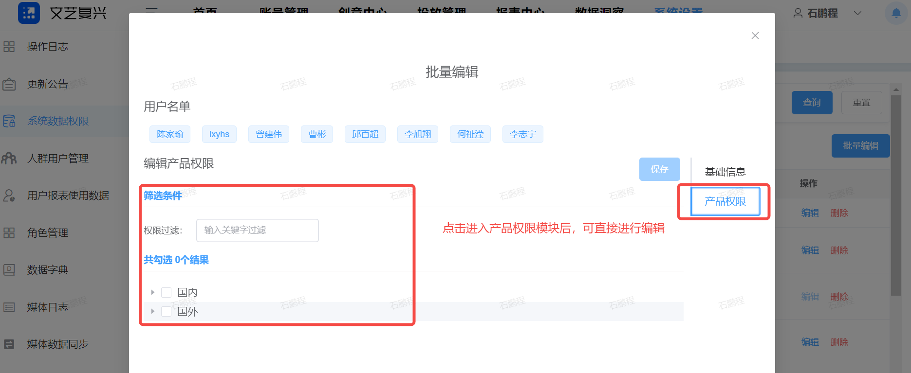
 |
| 第三步 | 
单独/批量编辑时，有两种方法可找到想编辑的产品：

1、可在“权限过滤”输入想查找的产品，下方勾选栏自动出现与输入内容相关的产品，进行产品勾选或取消勾选

2、可直接在勾选栏寻找产品，进行勾选或取消勾选

注：勾选代表想给用户添加产品权限，取消勾选代表取消该用户该产品的权限
 | 
方法1：

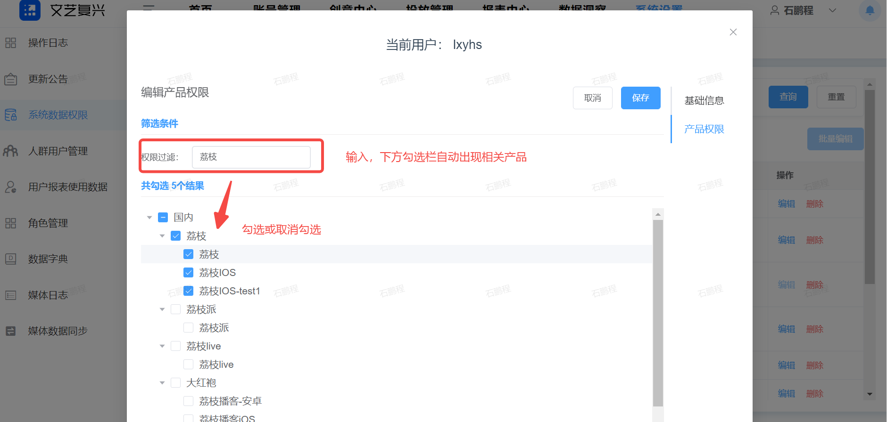方法2：

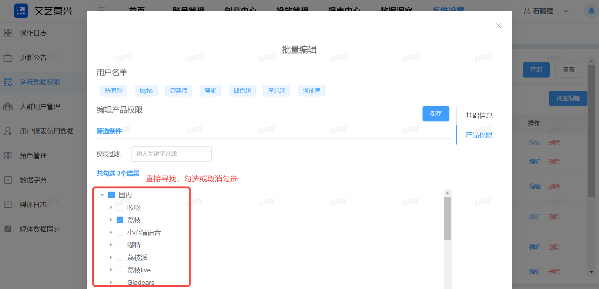
                                                                                           |
| 第四步 | 点击保存，权限生效                                                                                                                                                       | 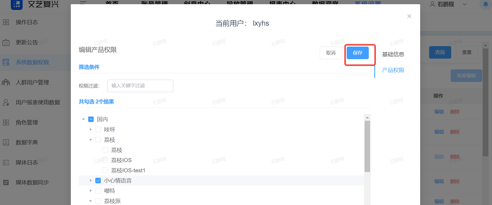                                                                                                                                                                    |

3）新增用户：新增某用户，包括基本信息（用户名称、账号名称、邮箱地址、角色、状态）

* 注：这步不包括产品权限的分配，若想进一步给用户分配产品权限，参考功能2编辑功能中产品权限部分的编辑步骤

| 步骤  | 操作                   | 图解                                                                |
| --- | -------------------- | ----------------------------------------------------------------- |
| 第一步 | 点击新增用户按键             | 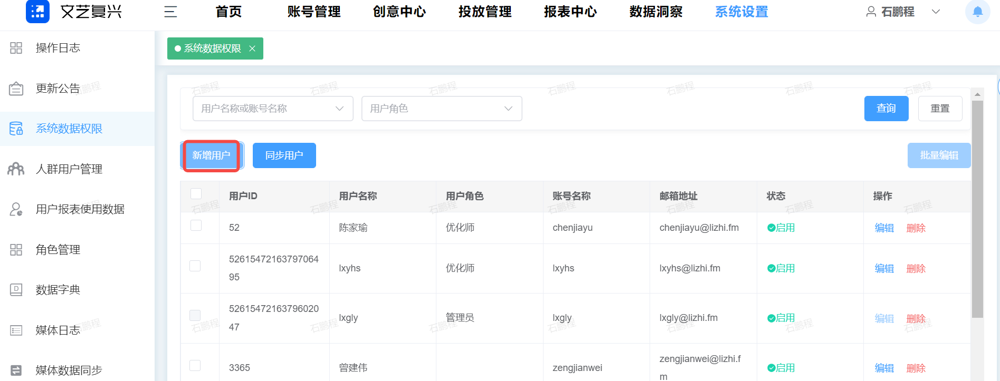 |
| 第二步 | 在弹窗内对基本信息进行填写，点击保存即可 |  |

4）同步用户：选择公司内部尚未添加到用户中的员工，添加到用户中

* 注1：这步不包括用户角色的添加，若要分配角色，参考功能2编辑功能中基本信息部分的编辑步骤；
* 注2：这步不包括产品权限的分配，若想分配产品权限，参考功能2编辑功能中产品权限部分的编辑步骤；
* 注3：同步用户与新增用户的不同在于，新增用户可添加公司外的人，且添加后不用对基本信息再进行编辑；而同步用户是直接从公司内的员工中选择，需对基本信息中的用户角色进行再编辑。

| 步骤  | 操作      | 图解                             |
| --- | ------- | ------------------------------ |
| 第一步 | 点击同步用户  | 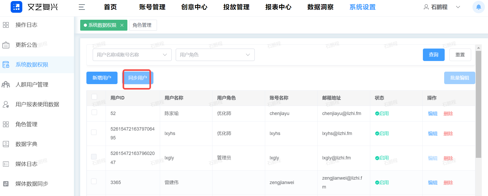 |
| 第二步 | 选择用户后保存 | 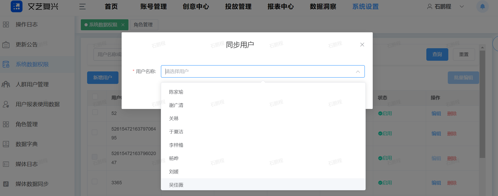 |

## 角色权限

1、进入路径：文艺复兴系统→系统设置→角色管理

2、主要功能与操作

1）查看权限：查看各角色在各系统菜单下的功能权限

| 步骤  | 操作                 | 图解                             | 备注                      |
| --- | ------------------ | ------------------------------ | ----------------------- |
| 第一步 | 点击选择角色             | 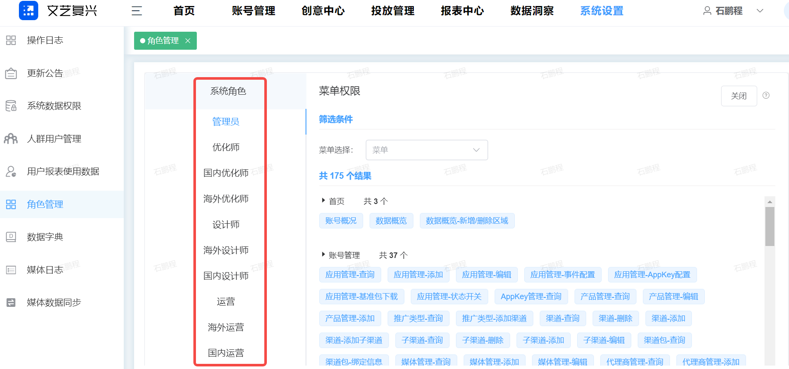 |                         |
| 第二步 | 在菜单选择中选择想查看权限的系统菜单 | 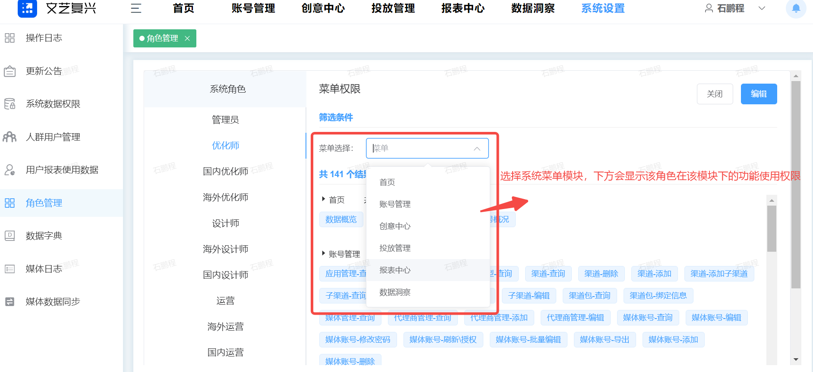 | 菜单选择为空时，下方显示该角色全部菜单下的权限 |

2）编辑权限：管理员对各系统角色在各系统菜单下的权限进行添加或删除

| 步骤  | 操作                                                                                                                                                                | 图解                                                                                                                                   |
| --- | ----------------------------------------------------------------------------------------------------------------------------------------------------------------- | ------------------------------------------------------------------------------------------------------------------------------------ |
| 第一步 | 点击角色后，点击编辑，出现编辑菜单权限页面                                                                                                                                             | 
点击角色：

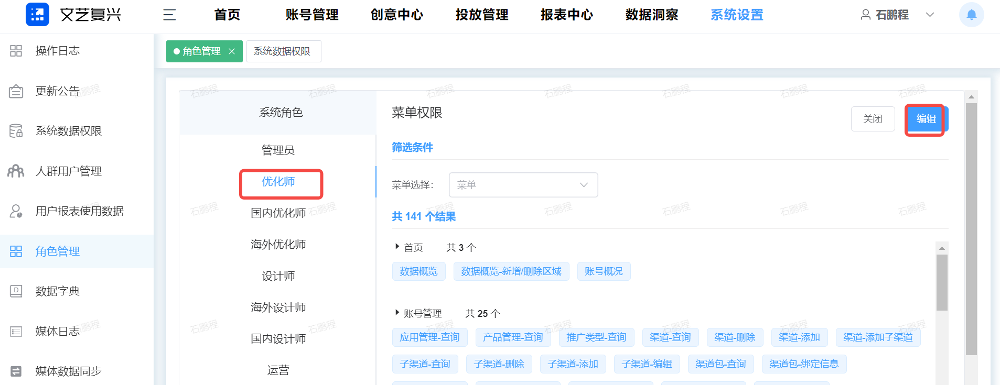

出现编辑菜单权限页面：

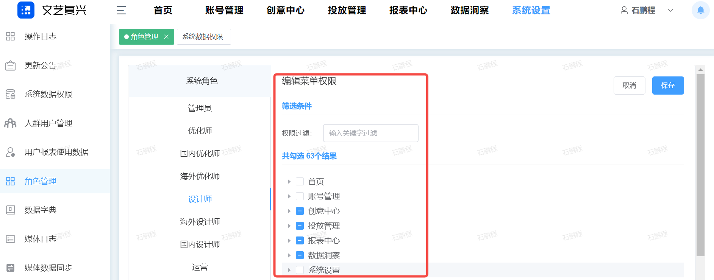
 |
| 第二步 | 
有两种方法可找到想编辑的菜单权限：

1、可在“权限过滤”输入想查找的菜单功能，下方勾选栏自动出现与输入内容相关的菜单功能，进行菜单功能的勾选或取消勾选

2、可直接在勾选栏寻找产品，进行勾选或取消勾选

注：勾选代表想给用户添加菜单权限，取消勾选代表取消该用户该菜单功能的权限
 | 
方法1：

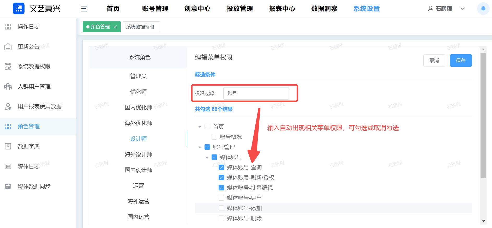方法2：

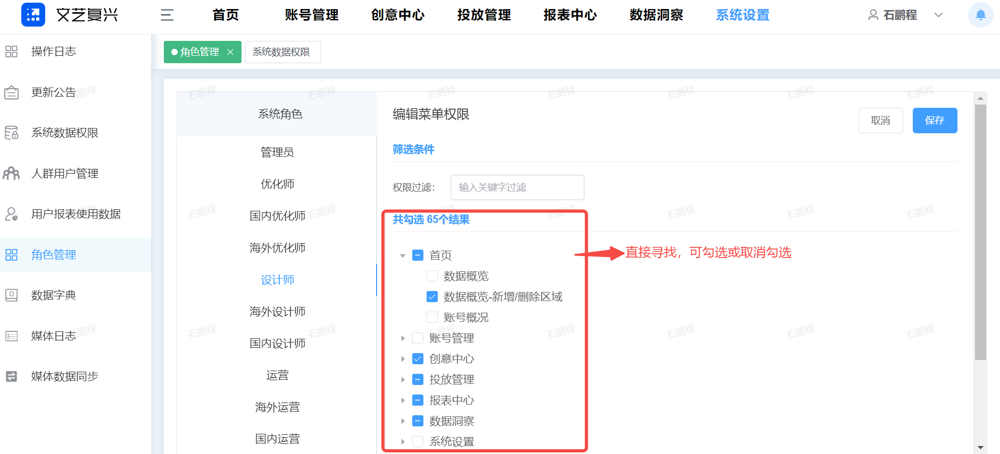
                |
| 第三步 | 点击保存，权限生效；点击取消，当前正在设置的权限清空                                                                                                                                        | 无                                                                                                                                    |
